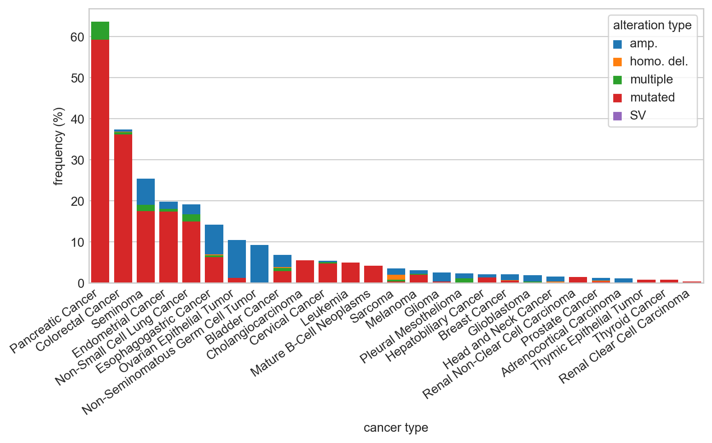

# Data exploration

date: 2022-0904

## Introduction

Basic, initial data exploration.

## Setup

### Imports


```python
%load_ext autoreload
%autoreload 2
```


```python
import janitor  # noqa: F401
import matplotlib.pyplot as plt
import numpy as np
import pandas as pd
import seaborn as sns
```


```python
from breezy import data as bd
from breezy import plotting as bp
```


```python
%matplotlib inline
%config InlineBackend.figure_format = 'retina'
bp.set_breezy_theme()
```

### Data


```python
kras_mut_freq = bd.cbioportal_kras_freq(cancer_type_inorder=True)
kras_mut_freq.head(3)
```


<div>
<style scoped>
    .dataframe tbody tr th:only-of-type {
        vertical-align: middle;
    }

    .dataframe tbody tr th {
        vertical-align: top;
    }

    .dataframe thead th {
        text-align: right;
    }
</style>
<table border="1" class="dataframe">
  <thead>
    <tr style="text-align: right;">
      <th></th>
      <th>cancer_type</th>
      <th>alteration_frequency</th>
      <th>alteration_type</th>
      <th>alteration_count</th>
    </tr>
  </thead>
  <tbody>
    <tr>
      <th>0</th>
      <td>Pancreatic Cancer</td>
      <td>4.347826</td>
      <td>multiple</td>
      <td>8</td>
    </tr>
    <tr>
      <th>1</th>
      <td>Pancreatic Cancer</td>
      <td>59.239130</td>
      <td>mutated</td>
      <td>109</td>
    </tr>
    <tr>
      <th>2</th>
      <td>Colorectal Cancer</td>
      <td>0.505051</td>
      <td>multiple</td>
      <td>3</td>
    </tr>
  </tbody>
</table>
</div>


```python
alterations = kras_mut_freq["alteration_type"].cat.categories
alteration_pal = {k: sns.color_palette("tab10")[i] for i, k in enumerate(alterations)}
```


```python
gtex_expr = bd.gtex_expression_data()
gtex_expr.head(3)
```


<div>
<style scoped>
    .dataframe tbody tr th:only-of-type {
        vertical-align: middle;
    }

    .dataframe tbody tr th {
        vertical-align: top;
    }

    .dataframe thead th {
        text-align: right;
    }
</style>
<table border="1" class="dataframe">
  <thead>
    <tr style="text-align: right;">
      <th></th>
      <th>expr</th>
      <th>dataset_id</th>
      <th>gencode_id</th>
      <th>gene_symbol</th>
      <th>source</th>
      <th>unit</th>
    </tr>
  </thead>
  <tbody>
    <tr>
      <th>0</th>
      <td>17.12</td>
      <td>gtex_v8</td>
      <td>ENSG00000133703.11</td>
      <td>KRAS</td>
      <td>thyroid</td>
      <td>TPM</td>
    </tr>
    <tr>
      <th>1</th>
      <td>13.74</td>
      <td>gtex_v8</td>
      <td>ENSG00000133703.11</td>
      <td>KRAS</td>
      <td>thyroid</td>
      <td>TPM</td>
    </tr>
    <tr>
      <th>2</th>
      <td>11.52</td>
      <td>gtex_v8</td>
      <td>ENSG00000133703.11</td>
      <td>KRAS</td>
      <td>thyroid</td>
      <td>TPM</td>
    </tr>
  </tbody>
</table>
</div>


```python
hpa_expr = bd.hpa_expression_data()
hpa_expr.head(3)
```


<div>
<style scoped>
    .dataframe tbody tr th:only-of-type {
        vertical-align: middle;
    }

    .dataframe tbody tr th {
        vertical-align: top;
    }

    .dataframe thead th {
        text-align: right;
    }
</style>
<table border="1" class="dataframe">
  <thead>
    <tr style="text-align: right;">
      <th></th>
      <th>gene</th>
      <th>data_type</th>
      <th>source</th>
      <th>unit</th>
      <th>expr</th>
    </tr>
  </thead>
  <tbody>
    <tr>
      <th>0</th>
      <td>KRAS</td>
      <td>Tissue RNA</td>
      <td>adipose tissue</td>
      <td>nTPM</td>
      <td>11.8</td>
    </tr>
    <tr>
      <th>1</th>
      <td>KRAS</td>
      <td>Tissue RNA</td>
      <td>adrenal gland</td>
      <td>nTPM</td>
      <td>9.1</td>
    </tr>
    <tr>
      <th>2</th>
      <td>KRAS</td>
      <td>Tissue RNA</td>
      <td>amygdala</td>
      <td>nTPM</td>
      <td>11.0</td>
    </tr>
  </tbody>
</table>
</div>


```python
hpa_expr["data_type"].unique()
```


    array(['Tissue RNA', 'Cell RNA', 'Blood RNA', 'Brain RNA',
           'Single Cell Type RNA'], dtype=object)


## Analysis

### Mutation frequency from cBioPortal


```python
fig, ax = plt.subplots(figsize=(8, 5))
ax = sns.histplot(
    kras_mut_freq,
    x="cancer_type",
    hue="alteration_type",
    weights="alteration_frequency",
    multiple="stack",
    shrink=0.8,
    palette=alteration_pal,
    alpha=1,
    lw=0,
)
ax.grid(visible=False, axis="x")

xlabels = kras_mut_freq["cancer_type"].cat.categories
ax.set_xlim(-0.5, len(xlabels) - 0.5)
ax.set_xticks(ticks=np.arange(len(xlabels)), labels=xlabels, rotation=35, ha="right")


ax.legend(
    handles=bp.pal_to_legend_handles(alteration_pal, marker="s", lw=0),
    title="alteration type",
    loc="upper right",
    handletextpad=1,
    handlelength=0,
    handleheight=0,
    frameon=True,
)
ax.set_ylabel("frequency (%)")
ax.set_xlabel("cancer type")
fig.tight_layout()
plt.show()
```


```python
mutation_freqs = (
    kras_mut_freq.query("alteration_type == 'mutated'")
    .sort_values("alteration_frequency", ascending=False)
    .reset_index(drop=True)
)
new_cancer_order = mutation_freqs["cancer_type"].astype("str").unique()
mutation_freqs["cancer_type"] = pd.Categorical(
    new_cancer_order, categories=new_cancer_order
)

fig, ax = plt.subplots(figsize=(8, 5))
sns.barplot(
    data=mutation_freqs,
    x="cancer_type",
    y="alteration_frequency",
    color=alteration_pal["mutated"],
)


xlabels = mutation_freqs["cancer_type"].cat.categories
ax.set_xlim(-0.5, len(xlabels) - 0.5)
ax.set_xticks(ticks=np.arange(len(xlabels)), labels=xlabels, rotation=35, ha="right")

ax.set_ylabel("frequency (%)")
ax.set_xlabel("cancer type")
fig.tight_layout()
plt.show()
```





### GTEx expression data


```python
median_order = (
    gtex_expr.groupby("source")["expr"]
    .median()
    .reset_index()
    .sort_values("expr", ascending=False)["source"]
    .values
)
plot_df = gtex_expr.copy()
plot_df["source"] = pd.Categorical(plot_df["source"], categories=median_order)

fig, ax = plt.subplots(figsize=(10, 3.5))
sns.boxplot(
    data=plot_df,
    x="source",
    y="expr",
    fliersize=1,
    ax=ax,
    linewidth=0.8,
    color="tab:purple",
)
ax.set_xticklabels(
    ax.get_xticklabels(),
    rotation=35,
    ha="right",
    size=6,
)
ax.grid(visible=True, axis="x")
ax.set_xlabel("source")
ax.set_ylabel("mRNA expression (TPM)")
ax.set_ylim(0, None)
plt.show()
```


### Human Protein Atlas cell-type expression


```python
hpa_single_cell = (
    hpa_expr.copy()
    .filter_column_isin("data_type", ["Single Cell Type RNA"])
    .reset_index(drop=True)
)

fig, ax = plt.subplots(figsize=(8, 4))

sns.barplot(data=hpa_single_cell, x="source", y="expr", ax=ax, color="tab:green")
ax.tick_params("x", rotation=90, labelsize=6)
ax.set_xlabel("source")
ax.set_ylabel("expression (nTPM)")
plt.show()
```


---

## Session Info


```python
%load_ext watermark
%watermark -d -u -v -iv -b -h -m
```

    Last updated: 2022-09-04

    Python implementation: CPython
    Python version       : 3.10.6
    IPython version      : 8.4.0

    Compiler    : Clang 13.0.1
    OS          : Darwin
    Release     : 21.5.0
    Machine     : x86_64
    Processor   : i386
    CPU cores   : 4
    Architecture: 64bit

    Hostname: JHCookMac.local

    Git branch: master

    numpy     : 1.23.2
    seaborn   : 0.11.2
    breezy    : 0.0.1
    matplotlib: 3.5.3
    pandas    : 1.4.4
    janitor   : 0.22.0


```python

```
